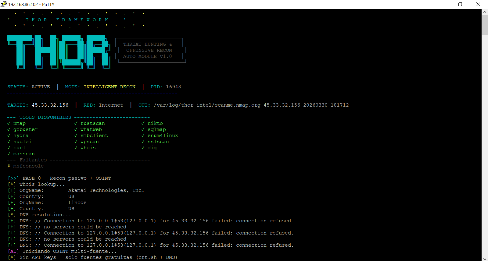
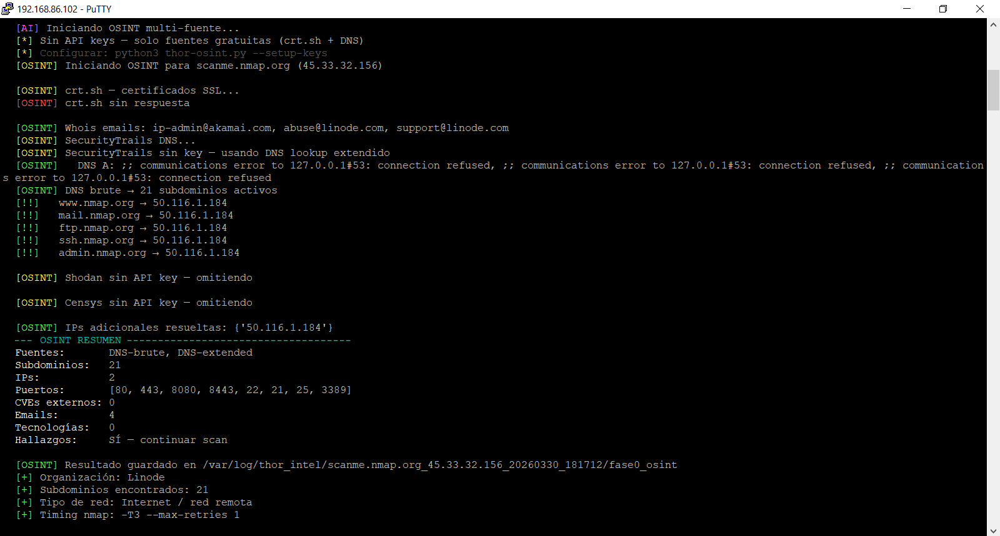
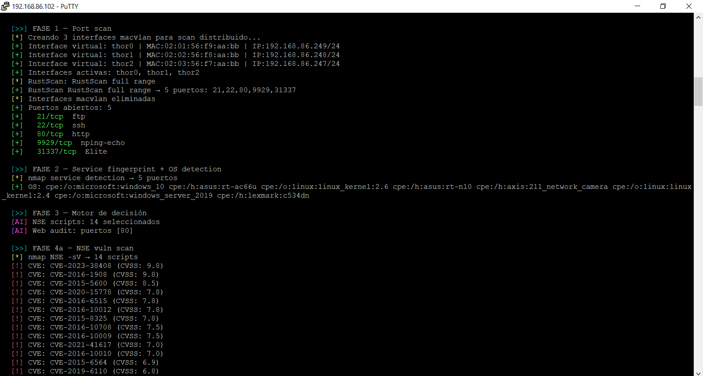
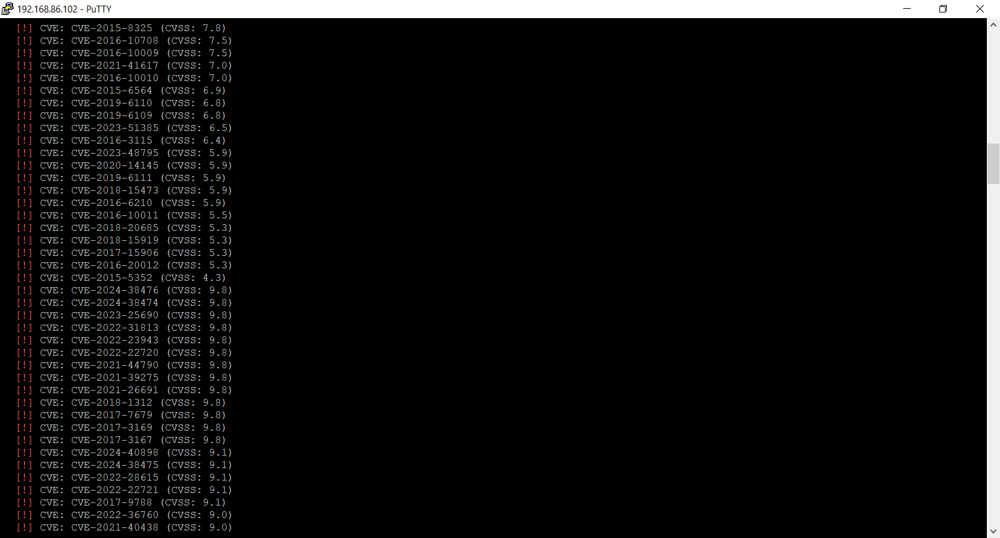
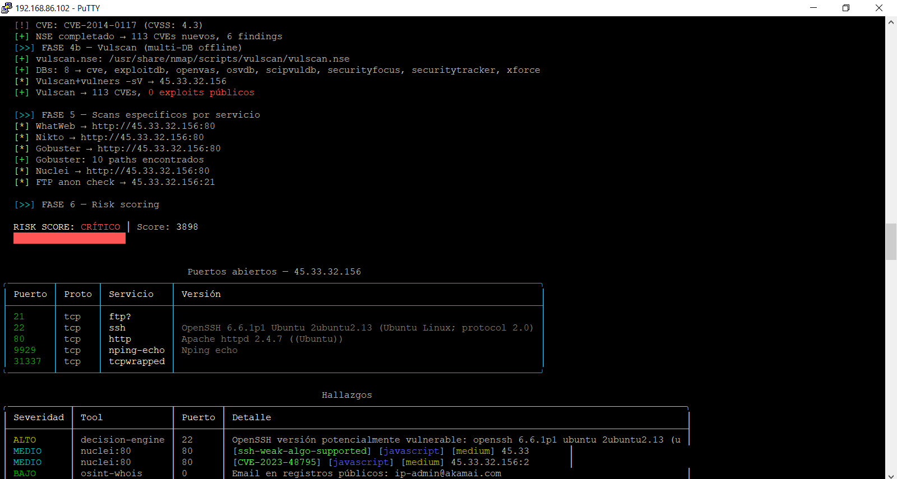
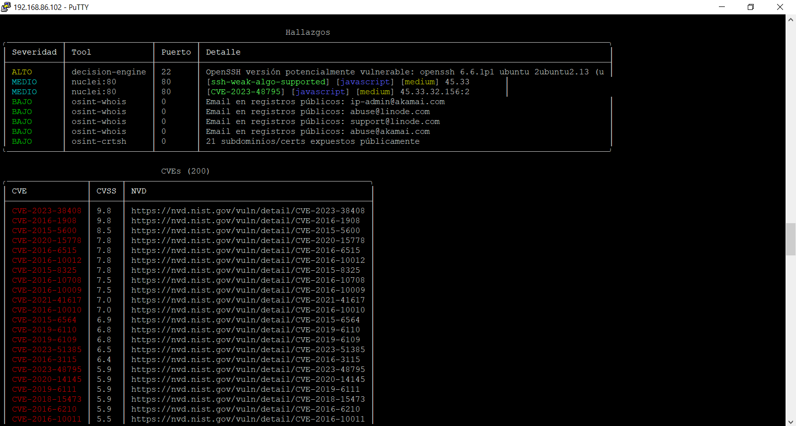
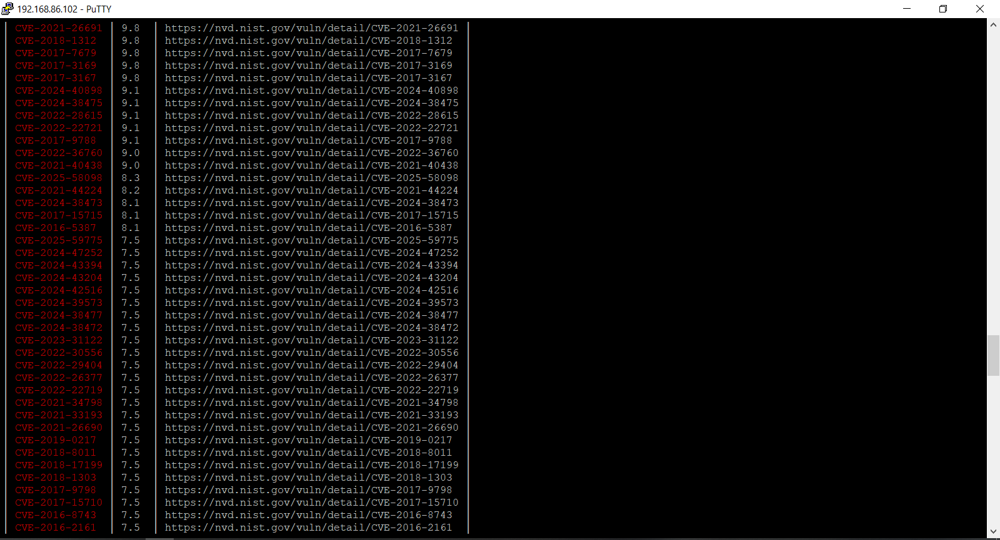
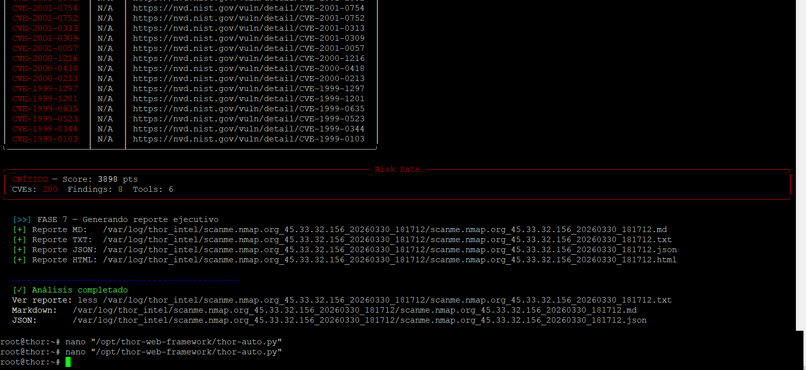

# THOR-autorecon

```
    ·  '  ·  .  '  ·  .  '  ·  .  '  ·  .  '  ·
  '  -  T H O R   F R A M E W O R K  -  '
    ·  '  ·  .  '  ·  .  '  ·  .  '  ·  .  '  ·

  ████████╗██╗  ██╗ ██████╗ ██████╗
  ╚══██╔══╝██║  ██║██╔═══██╗██╔══██╗
     ██║   ███████║██║   ██║██████╔╝
     ██║   ██╔══██║██║   ██║██╔══██╗
     ██║   ██║  ██║╚██████╔╝██║  ██║
     ╚═╝   ╚═╝  ╚═╝ ╚═════╝ ╚═╝  ╚═╝

  ┌─────────────────────┐
  │  THREAT HUNTING &   │
  │  OFFENSIVE RECON    │
  │  AUTO MODULE v1.0   │
  └─────────────────────┘
```

**THOR-autorecon** is an autonomous, modular Python framework for passive and active reconnaissance and vulnerability mapping. It never touches the target directly in its passive phase — all active scanning is performed through configurable evasion strategies and distributed virtual interfaces.

Designed for security researchers, red teamers, and pentesters who need a **hands-off, intelligent recon pipeline** that adapts to the target and learns from previous scans.

---

## Live Demo — Example Report

> Real scan against `scanme.nmap.org` (official Nmap test host) — authorized target

**[→ View live HTML report](https://ivandiaztnd.github.io/thor-autorecon/example-report-scanme.nmap.org.html)** — 200 CVEs · Risk Score CRÍTICO 3898 pts · 19 min runtime

---

## Screenshots

**1 — Startup: ASCII banner, tool detection (15 tools available), Phase 0 passive recon — whois resolves Akamai/Linode, OSINT multi-source initiated**


**2 — Phase 0 OSINT: crt.sh, Whois email extraction (ip-admin@akamai.com, abuse@linode.com), DNS brute → 21 active subdomains (www, mail, ftp, ssh, admin...), 2 IPs resolved, 4 emails found**


**3 — Phase 1: macvlan rotation (thor0/thor1/thor2, distinct MACs/IPs), RustScan full range → 5 ports (21/ftp, 22/ssh, 80/http, 9929, 31337), Phase 2 fingerprint, Phase 3 decision engine selects 14 NSE scripts, Phase 4a CVE flood begins (CVE-2023-38408 CVSS:9.8)**


**4 — Phase 4a continued: CVE flood from NSE+vulners — mix of 2024/2023/2022/2021 CVEs with CVSS 9.8, 9.1, 9.0, 8.3, 8.1, 7.5 scores in real time**


**5 — Phase 4b Vulscan (8 offline DBs: cve, exploitdb, openvas, osvdb, scipvuldb, securityfocus, securitytracker, xforce) → 113 CVEs, Phase 5 targeted tools (WhatWeb, Nikto, Gobuster 10 paths, Nuclei, FTP anon check), Phase 6 Risk Scoring CRÍTICO 3898 pts, rich terminal table: ports + services + findings**


**6 — End of CVE list (vulscan offline DBs, CVEs from 1999-2001 with NVD links), Risk Rate panel CRÍTICO 3898 pts — CVEs: 200, Findings: 8, Tools: 6, Phase 7 report generation → MD/TXT/JSON/HTML output paths, scan complete**


**7 — Rich CVE table: high-CVSS entries in red with CVSS scores and direct NVD links (CVE-2021-26691 9.8, CVE-2018-1312 9.8, CVE-2024-40898 9.1, CVE-2025-58098 8.3, CVE-2025-59775 7.5...)**


**8 — Full OSINT summary: DNS-brute + DNS-extended sources, 21 subdomains, 2 IPs, suggested ports [80,443,8080,8443,22,21,25,3389], 4 emails, Hallazgos: Sí — continuar scan**


---

## Features

- **7-phase autonomous pipeline** — from passive OSINT to risk-scored HTML/JSON/Markdown reports, fully automated
- **Adaptive memory system** — learns which tools and techniques are most effective per service type across scans
- **Multi-source OSINT** — crt.sh (no key), SecurityTrails, Shodan, Censys, DNS extended, Whois email extraction
- **11 evasion strategies** — SYN, TCP Connect, fragmentation, decoy, source port spoofing, TTL manipulation, macvlan interface rotation, and more
- **Intelligent decision engine** — dynamically selects NSE scripts, web auditors, and specialized tools based on discovered services
- **CVE correlation** — cross-references findings against NVD, ExploitDB, VulDB, MITRE, OpenVAS, OSVDB, SecurityFocus, and SecurityTrails
- **Rich terminal dashboard** — live tables with port/service/CVE data via `rich`
- **Multi-format reports** — HTML (with risk scoring gauge), JSON, Markdown, and plain text
- **Auto-install** — detects missing tools and offers APT + custom installers for RustScan, Nuclei, WPScan, enum4linux, vulscan NSE

---

## Pipeline Overview

```
Phase 0 — Passive recon + OSINT
    └── whois, dig, crt.sh, DNS extended, SecurityTrails, Shodan, Censys
    └── Extracts: subdomains, IPs, open ports, CVEs, emails, org info, technology stack

Phase 1 — Port scanning (adaptive)
    └── RustScan (if available) → nmap confirmation
    └── 11 fallback strategies: SYN, TCP Connect, forced ports, stealth/fragmented,
        source port :53/:80, decoy (RND:5), TTL+padding, UDP, ACK, slow T1
    └── macvlan virtual interface rotation for distributed scanning identity

Phase 2 — Service fingerprint + OS detection
    └── nmap -sV -O --version-intensity 7
    └── Enriches port data with version strings and OS guesses

Phase 3 — Decision engine
    └── Classifies ports into: web, smb, ssh, ftp, db, ssl, voip, rdp, smtp, telnet,
        redis, mongodb — per-service NSE script selection
    └── Integrates OSINT data (known ports, detected tech) to enrich scan plan
    └── Flags: WordPress → WPScan, SSL certs → ssl-heartbleed/ssl-poodle,
        old OpenSSH → sshv1, Telnet exposed → CRÍTICO finding

Phase 4a — NSE vuln scan
    └── nmap --script vuln,exploit,vulners + service-specific scripts
    └── CVEs parsed with CVSS scores, exploit links flagged

Phase 4b — Vulscan (offline multi-DB)
    └── vulscan.nse against: cve.csv, exploitdb.csv, openvas.csv, osvdb.csv,
        scipvuldb.csv, securityfocus.csv, securitytracker.csv, xforce.csv
    └── Exploit entries score +30 pts each

Phase 4c — Memory fallback
    └── If Phases 4a/4b yield 0 CVEs, queries ThorMemory for effective recipes
        from previous scans against same service types

Phase 5 — Targeted tool execution
    └── Web: nikto, gobuster, whatweb, sqlmap, WPScan (WordPress)
    └── SMB/AD: smbclient, enum4linux
    └── SSL: sslscan
    └── Credentials: hydra (recon-only, no destructive actions)
    └── General: nuclei (template-based)
    └── Masscan for additional coverage

Phase 6 — Risk scoring
    └── Additive scoring model:
        Base exposure (critical ports open): +5 pts each
        CVE found: +10 pts each
        CVE with public exploit: +30 pts each
        CVE from OSINT sources: +10 pts each
        Telnet exposed: +40 pts flat
    └── Levels: INFORMATIVO (0-9) / BAJO (10-39) / MEDIO (40-79) /
               ALTO (80-149) / CRÍTICO (150+)

Phase 7 — Report generation
    └── HTML: risk gauge, score breakdown, ports table, CVE list, findings,
              tech stack pills, tools executed, OSINT section
    └── JSON: full machine-readable output
    └── Markdown: structured report for documentation pipelines
    └── TXT: plain text for logging and grep
```

---

## OSINT Sources

| Source | Key required | Data extracted |
|--------|-------------|----------------|
| crt.sh | No | Subdomains, SSL certificates, issuers |
| DNS extended | No | A, MX, NS, TXT, AAAA records |
| Whois | No | Emails, org name, registrant |
| SecurityTrails | Optional (free tier) | Historical DNS, subdomains |
| Shodan | Optional (free tier) | Open ports, banners, CVEs, honeypot flag, ASN |
| Censys | Optional (free tier) | Services, TLS data, software versions |

API keys are stored in `/etc/thor/osint_keys.json` (chmod 600). Configure interactively:

```bash
python3 thor-osint.py --setup-keys
```

Without keys, THOR still runs crt.sh + DNS + Whois passively before active scanning.

---

## Evasion Techniques (Phase 1)

| Strategy | Method |
|----------|--------|
| RustScan full range | 1-65535, configurable ulimit |
| RustScan anti-firewall | ulimit 500, timeout 4000ms |
| Normal SYN scan | -sS -Pn |
| TCP Connect (firewall bypass) | -sT -Pn |
| Forced critical ports | 30 hardcoded high-value ports |
| Stealth fragmented | -f --mtu 24 --data-length 32 |
| Source port :53 | DNS port spoofing |
| Source port :80 | HTTP port spoofing |
| Decoy scan | -D RND:5 |
| TTL + padding | --ttl 128 --data-length 48 |
| UDP services | DNS, SNMP, NTP, TFTP, NetBIOS |
| ACK scan | Firewall rule mapping |
| Slow T1 | --scan-delay 2s |
| macvlan rotation | Virtual interfaces with distinct MACs/IPs for distributed identity |

---

## Adaptive Memory

THOR maintains a persistent JSON memory at `/var/log/thor_intel/.thor_memory.json` that tracks:

- Total scans executed
- Per-service tool effectiveness (hits vs misses)
- CVE yield per tool/service combination
- Effective command hints for future reuse

On every scan, Phase 4c consults memory: if active scanning yields no CVEs, it replays the most effective historical commands for the detected service types.

---

## Requirements

### System

- Debian/Ubuntu Linux (Kali recommended)
- Python 3.8+
- Root or sudo access (required for raw socket operations)

### Python dependencies

```
rich
```

### Tools (auto-installed on first run if missing)

**Critical (required):**
- `nmap`
- `curl`
- `git`
- `python3`

**Optional (installed interactively):**
- `rustscan` — ultra-fast port scanner (custom installer, x86_64/arm64/armhf)
- `nikto` — web vulnerability scanner
- `gobuster` — directory brute force
- `whatweb` — web technology fingerprinting
- `hydra` — brute force (recon mode only)
- `sqlmap` — SQL injection detection
- `smbclient` — SMB share enumeration
- `enum4linux` — SMB/AD enumeration (Portcullis Labs installer)
- `sslscan` — SSL/TLS audit
- `masscan` — fast port scanner
- `nuclei` — template-based vulnerability scanner (ProjectDiscovery)
- `wpscan` — WordPress scanner (gem installer)
- `whois`, `dig`, `nbtscan`, `jq`
- `vulscan NSE` — offline multi-DB nmap script (auto-cloned from GitHub)

---

## Installation

```bash
git clone https://github.com/ivandiaz/thor-autorecon.git
cd thor-autorecon
pip3 install rich
```

No further setup required. THOR will detect missing tools on first run and offer to install them.

---

## Usage

```bash
# Basic scan
sudo python3 thor-auto.py <target>

# Examples
sudo python3 thor-auto.py 45.33.32.156
sudo python3 thor-auto.py scanme.nmap.org
sudo python3 thor-auto.py 192.168.1.0/24

# Custom output directory
sudo python3 thor-auto.py scanme.nmap.org --output /tmp/myscan

# OSINT module standalone
python3 thor-osint.py scanme.nmap.org

# Configure OSINT API keys
python3 thor-osint.py --setup-keys

# Show configured keys
python3 thor-osint.py --show-keys
```

---

## Output Structure

```
/var/log/thor_intel/<domain>_<ip>_<timestamp>/
├── scan.log                    # Full execution log with timestamps
├── <report_base>.html          # Main HTML report (risk gauge + full findings)
├── <report_base>.json          # Machine-readable full output
├── <report_base>.md            # Markdown report
├── <report_base>.txt           # Plain text report
├── fase0_pasivo/
│   ├── whois.txt
│   └── dig.txt
├── fase0_osint/
│   └── osint_result.json       # Full OSINT data (subdomains, IPs, CVEs, emails)
├── fase1_ports/
│   ├── ports.txt
│   ├── ports.xml
│   └── rustscan.txt
├── fase2_services/
│   └── services.txt
├── fase4_nse/
│   ├── vulns.txt
│   ├── vulns.xml
│   ├── vulscan.txt
│   └── vulscan_exploits.txt
└── fase5_*/                    # Per-tool output directories
```

---

## Risk Scoring Model

```
Score range   Level           Description
──────────────────────────────────────────────────────
0 – 9         INFORMATIVO     No significant exposure
10 – 39       BAJO            Low exposure, limited attack surface
40 – 79       MEDIO           Moderate risk, review recommended
80 – 149      ALTO            High risk, immediate attention required
150+          CRÍTICO         Critical exposure, active exploit risk
──────────────────────────────────────────────────────

Scoring contributors:
  +5  pts    Each critical port exposed (22, 25, 80, 139, 443, 445, 3306, 3389…)
  +10 pts    Each CVE found (any source)
  +30 pts    Each CVE with confirmed public exploit (*EXPLOIT*)
  +10 pts    Each CVE from external OSINT sources (Shodan, Censys)
  +40 pts    Telnet exposed (flat penalty)
```

---

## CVE Sources Correlated

- **NVD / vulners** — via nmap NSE `vulners` script
- **ExploitDB** — via vulscan + vulners, exploit flag parsed
- **MITRE CVE** — via vulscan offline DB
- **VulDB** — via vulscan offline DB
- **OpenVAS** — via vulscan offline DB
- **OSVDB** — via vulscan offline DB
- **SecurityFocus** — via vulscan offline DB
- **SecurityTracker** — via vulscan offline DB
- **Shodan** — via OSINT module (CVEs per host)
- **Censys** — via OSINT module (software version correlation)

---

## Verified Test Targets

THOR has been tested against public legal targets:

- `scanme.nmap.org` — official Nmap test host
- Additional public free-scan targets (testphp.vulnweb.com, etc.)

**All scans produced CVE findings with CVSS scores and multi-DB correlation.**

> Only scan systems you own or have explicit written permission to test.
> THOR is designed for authorized penetration testing and security research only.

---

## Project Structure

```
thor-autorecon/
├── thor-auto.py        # Entry point — arg parsing, target resolution, orchestration
├── thor_deps.py        # Dependency management, tool detection, auto-install logic,
│                       # color system, utility functions (cmd, status, sanitize)
├── thor_phases.py      # ThorMemory + ThorAuto class with all 7 phases,
│                       # report generation (HTML/JSON/MD/TXT), rich dashboard
├── thor-osint.py       # OSINT module — crt.sh, Shodan, Censys, SecurityTrails,
│                       # DNS extended, Whois — importable or standalone
└── requirements.txt    # Python dependencies
```

---

## Architecture Notes

**thor-auto.py** is a slim entry point (~30 lines). It handles argument parsing, target resolution (hostname → IP), and delegates everything to `ThorAuto`.

**thor_deps.py** manages the full dependency lifecycle: detection (`has_tool`), APT batch install, and custom installers for tools not in APT (RustScan, Nuclei, WPScan, enum4linux, vulscan NSE). Also exports shared utilities used across all modules: `cmd()`, `status()`, `is_local()`, `sanitize_target()`, `sanitize_name()`, color class `C`, and `print_banner()`.

**thor_phases.py** contains `ThorMemory` (adaptive scan history) and `ThorAuto` (the full engine). Each phase method is self-contained and writes its output to a dedicated subdirectory under `/var/log/thor_intel/<scan>/`. The decision engine in Phase 3 reads both active scan results and OSINT data to build a combined attack plan.

**thor-osint.py** is fully standalone — can be run independently or imported by `ThorAuto.phase0_passive()` via `importlib`. It manages API keys in `/etc/thor/osint_keys.json` and returns an `OsintResult` object consumed by the main pipeline.

---

## Author

**Iván Alberto Díaz**  
Senior IT Engineer | Red Team Practitioner | LPIC-1 | LPIC-2  
Buenos Aires, Argentina  
[linkedin.com/in/ivan-alberto-diaz-0b345410](https://linkedin.com/in/ivan-alberto-diaz-0b345410)

---

## Related Projects

- **THOR Enterprise** — Full RedTeam, Threat Hunt & Offensive Recon Engine Framework with web dashboard, multi-tier executive reports (CEO/CFO, SOC/IT, Technical), and Flask/AJAX frontend. *(Closed source)*
- **OSIRIS-AI** — AI-assisted autonomous pentest framework powered by local LLMs via Ollama (phi3, phi4, dolphin). Zero cloud dependency, runs on any hardware. *(In development)*

---

## License

GNU General Public License v3.0 — see [LICENSE](LICENSE)

This program is free software: you can redistribute it and/or modify it under the terms of the GNU General Public License as published by the Free Software Foundation, either version 3 of the License, or (at your option) any later version.

> This tool is provided for authorized security testing and research only.  
> The author assumes no liability for misuse.
